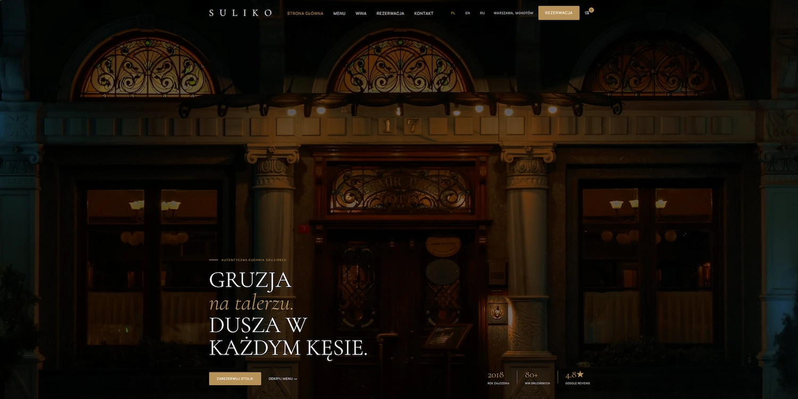
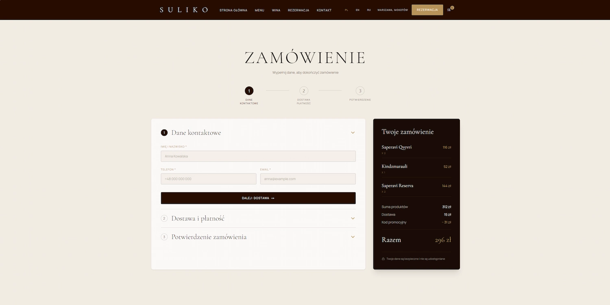

# Suliko Restaurant

A multilingual restaurant website featuring online ordering and table reservations.




[🌐 Live Demo](https://suliko-restaurant.netlify.app/) · [📂 GitHub Repository](https://github.com/HelenKohun/suliko-restaurant)

---

## About the Project

Suliko is a multilingual restaurant website designed as a complete digital experience for a modern Georgian restaurant. Inspired by the atmosphere of premium dining, the project focuses on creating a welcoming first impression while supporting every stage of the guest's journey - from exploring the menu and discovering wines to reserving a table or placing an online order. Every feature was designed to make the experience intuitive, comfortable, and to strengthen trust between the restaurant and its guests.

## Key Features

- Responsive design optimized for desktop and mobile devices.
- Multilingual interface (English, Polish and Russian).
- Interactive menu with category filtering.
- Wine catalogue with filtering by type, style and region.
- Online ordering with a persistent shopping cart.
- Checkout flow with client-side validation.
- Table reservation form with date and time selection.
- SEO optimization and accessibility improvements.

## Tech Stack

- React
- Vite
- Tailwind CSS
- React Router
- Zustand
- React Hook Form
- i18next
- React Helmet Async
- React Leaflet

## Project Structure

```text
src/
├── assets/        Images and static media
├── components/    Reusable UI components
├── config/        Project configuration
├── constants/     SEO data
├── data/          Menu, wine, navigation, and booking data
├── i18n/          Translation files and localization setup
├── layouts/       Shared page layouts
├── pages/         Route-level page components
├── sections/      Larger homepage sections
├── store/         Global state management with Zustand
├── utils/         Reusable helper functions
```

## Getting Started

### Requirements

- Node.js 20.19+
- npm

```bash
git clone https://github.com/HelenKohun/suliko-restaurant.git

cd suliko-restaurant

npm install

npm run dev
```

## Future Improvements

- Integrate **Supabase** to store and manage online orders, table reservations, and restaurant data.
- Develop an **admin dashboard** for managing the menu, wine catalogue, orders, and reservations.
- Implement **administrator authentication** to securely access the management panel.
- Add **email notifications** for reservation and order confirmations.
- Enhance the user experience with **subtle animations and microinteractions**.

## Author

**Helen Kohun**

Frontend Developer

- GitHub: https://github.com/HelenKohun
- LinkedIn: https://www.linkedin.com/in/olena-kohun-a800a8305/
